# Full-Stack Mini Uber--Django Web-App
<div align="center">
  
</div>
A versatile Django-based web application to streamline ride sharing and management. The platform supports multiple user roles (Ride Owner, Ride Driver, Ride Sharer) and complex functionalities, showcasing full-stack development expertise.

⛳ This web-app assembles Uber, which lets users request, drive for, and join rides. It has three roles: ride owner, Driver, and ride sharer. Integrated advanced functionalities like account creation, login/logout, and role-specific actions, catering to the diverse needs of each user type within the platform. The functionalities include:

- [Create account](#1-register)
- [Login/Logout:Handle login failure](#2-login)
- [User home page](#3-home-page)
- [Driver Registration](#4-driver-register-page)
- [Driver home page](#5-driver-home)
- [view and edit their driver status as well as personal and vehicle info](#6-driver-profile)
- [Ride list and selection](#8-view-my-ride)
- [Ride Requesting](#7-take-a-ride)
- [Ride Request Viewing and Editing (Owner / sharer)](#11-ride-detailsusers-version)
- [Ride Status Viewing (Driver)](#12-driver-list-of-comfirmed-rides)
- [Ride Searching (Driver)](#10-driver-search-for-eligible-requests)
- [Ride Searching (Sharer)](#9-join-a-ride-by-search-sharer)
- [See comfirmed list(Driver)](#12-driver-list-of-comfirmed-rides)
- [View all of the ride details(Owner/sharer)](#11-ride-detailsusers-version)
- [Edit a confirmed ride to complete(Driver)](#13-driver-order-detail)
- **Send email to ride owner and sharer when the ride is confirmed by driver(use Gmail API)**


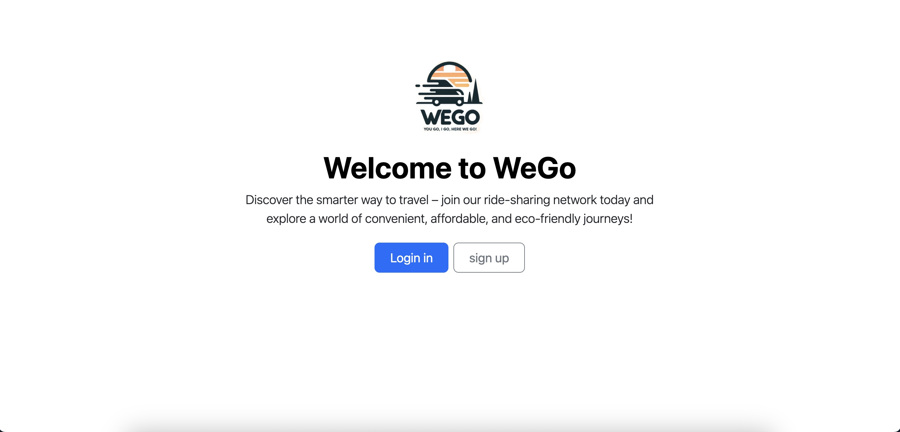

**💠 Now enjoy this project!**

## Demo
### 1. Register
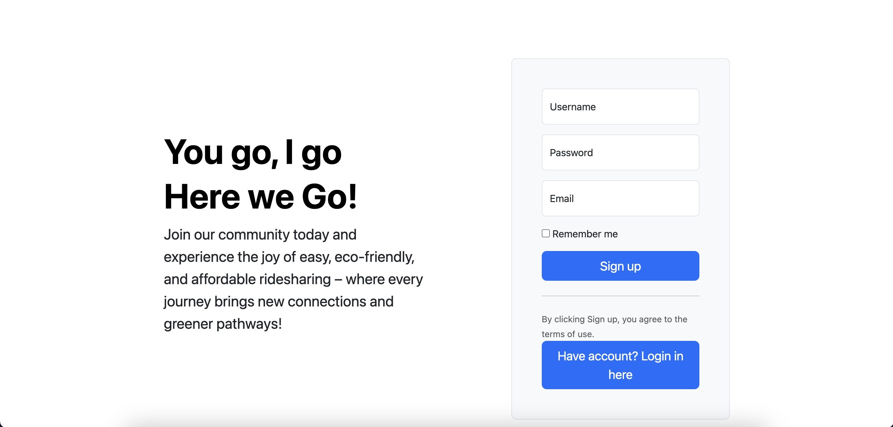

### 2. Login
including login failure handling


### 3. Home Page
In the top of home page, I am using a carousel to show the pictures with entrance to some main functions.

<div align="center">
  
</div>

### 4. Driver register page
if already registered, redirect to driver home


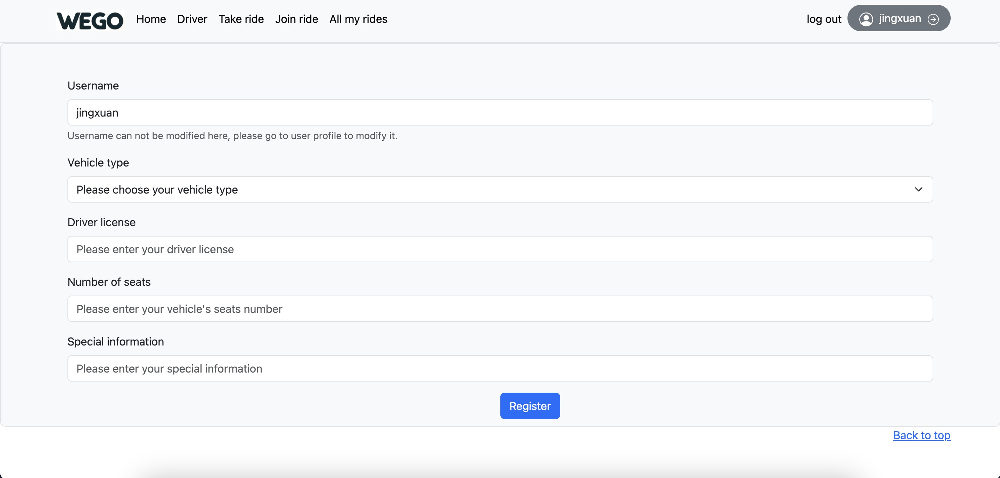

### 5. Driver home
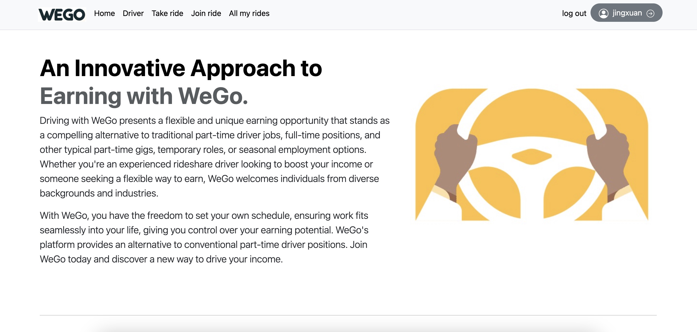
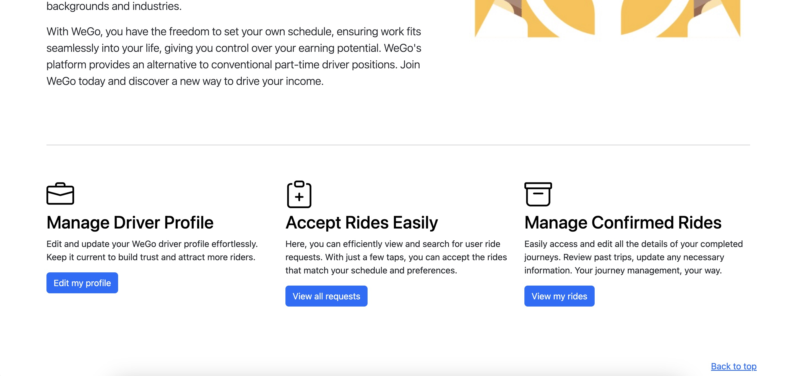

### 6. Driver profile
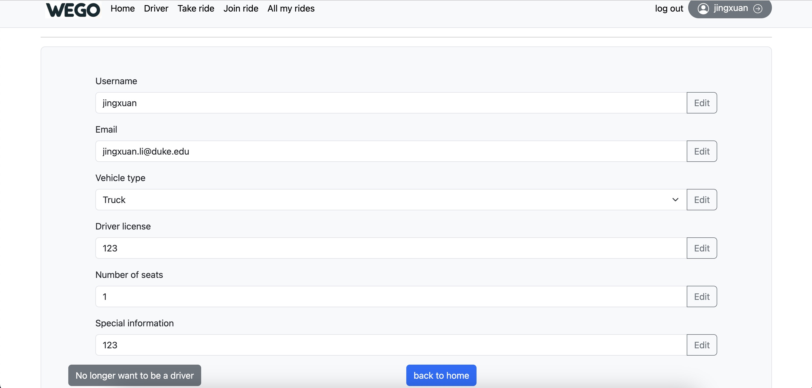

### 7. Take a Ride

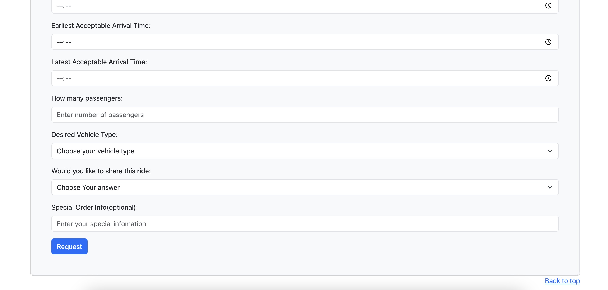

### 8. View my Ride


### 9. Join a Ride by search (sharer)
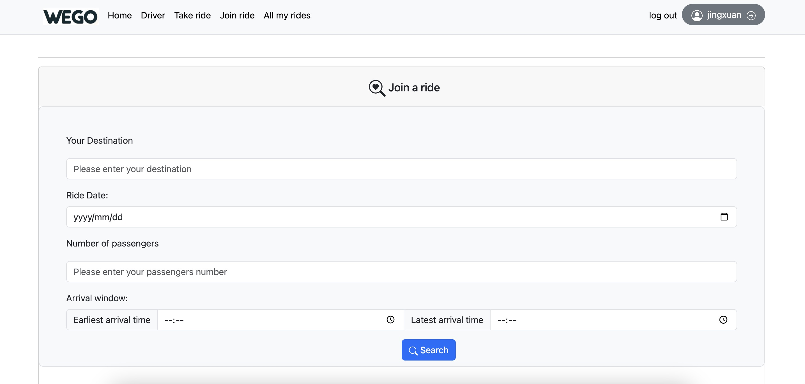


### 10. Driver search for eligible requests
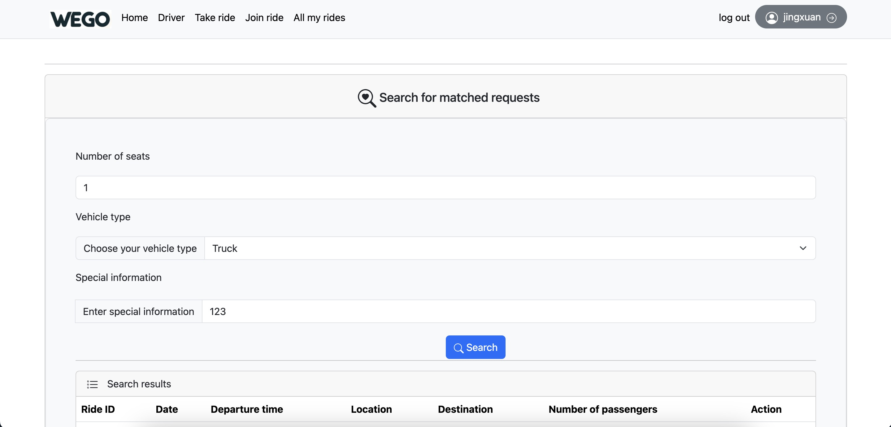

### 11. Ride details(user's version)
1. before ride being confirmed,can edit order details or cancel order
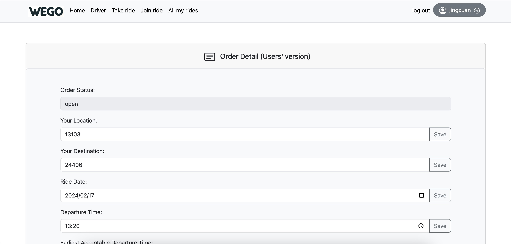
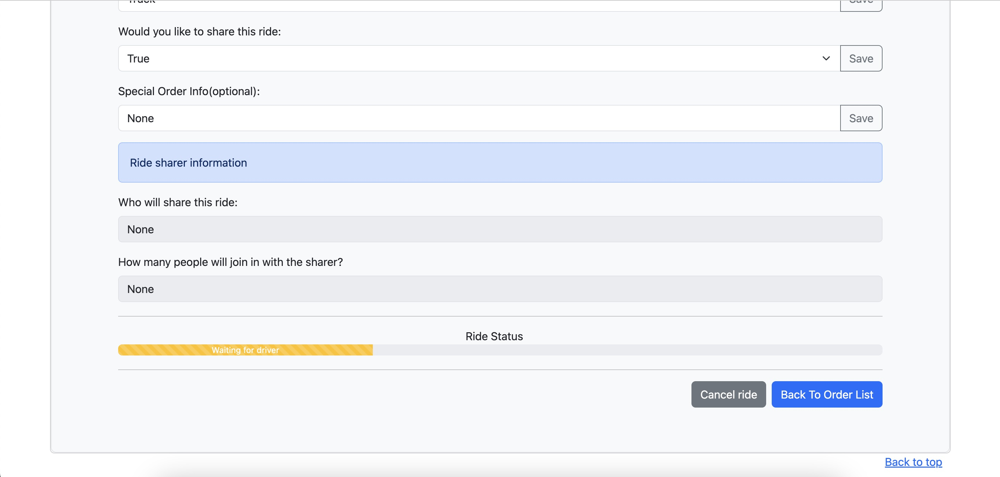
2. after ride being confirmed by driver(show driver info,can not edit or cancel order)
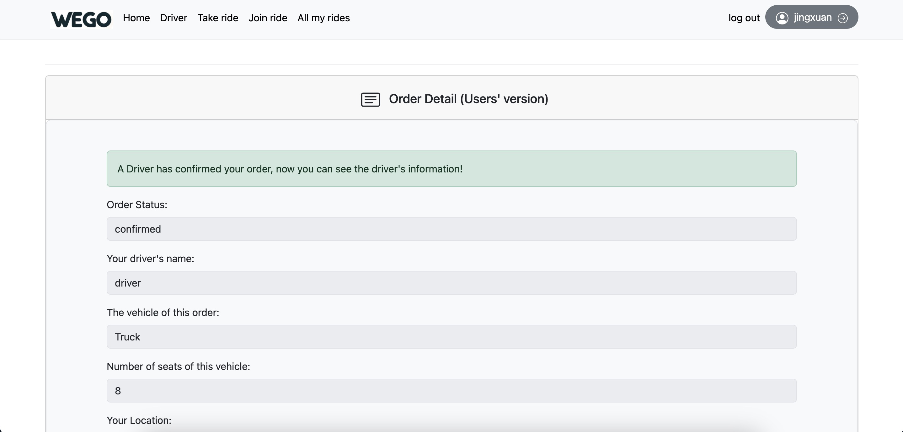
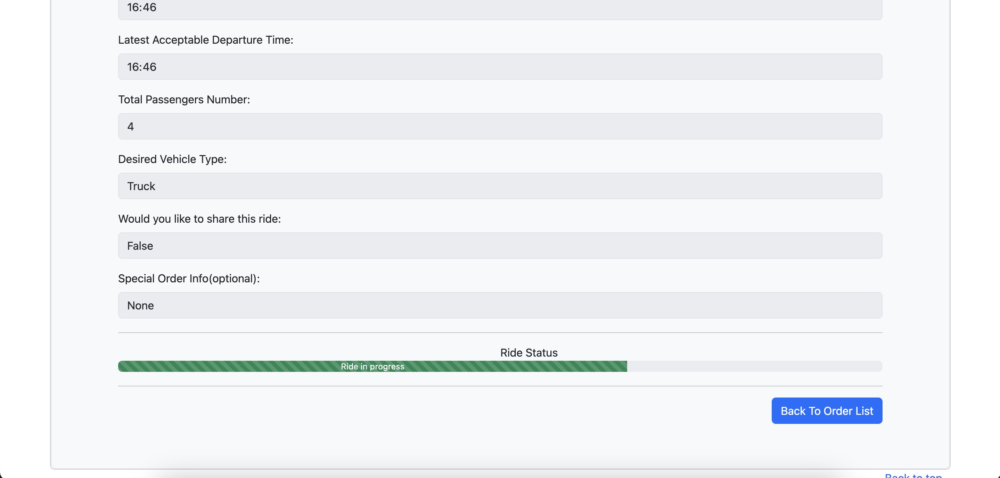
3.after order completed
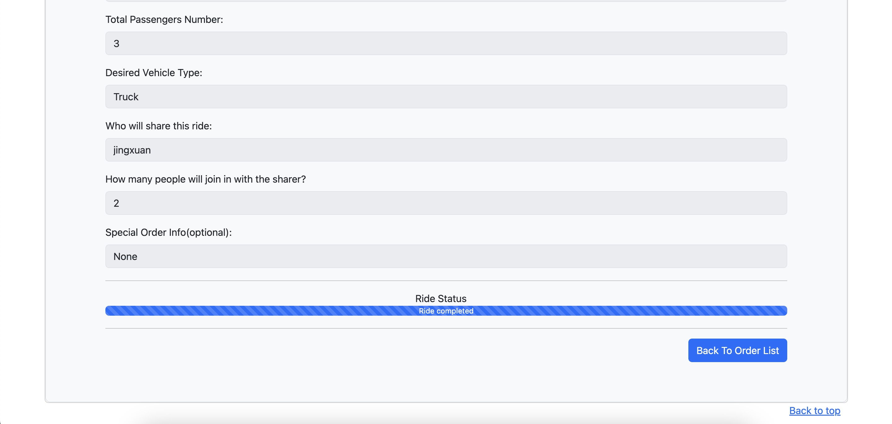


### 12. Driver list of comfirmed rides
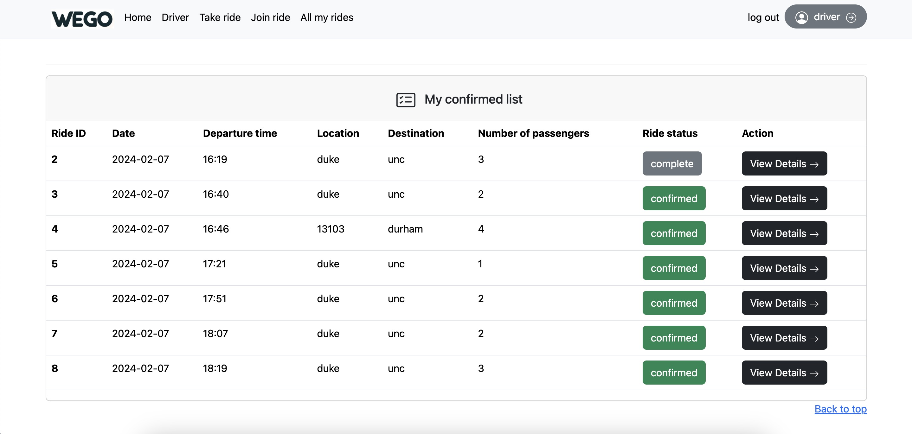

### 13. Driver order detail
can mark as complete


## Usage Instruction

### Docker

In order for easier setting up, you can use the provide Docker setting.

```
git clone git@github.com:MorganeLu/Django-web-app.git
cd Django-web-app
cd erss-hwk1-kl461-jl1226
sudo docker-compose up
```

Just wait for a second, you can see visit our website by localhost:8000.

### Local Machine

If you prefer to run this demo on your own personal computer, you can set it up by following the instructions below.

```
git clone git@github.com:MorganeLu/Django-web-app.git
cd Django-web-app
```

After that you have to set up your own database by using Postgres.

```
sudo su - postgres
psql
CREATE user brian;   //replace brian with your username. note the ';' at the end
ALTER USER brian CREATEDB;    //again, replace brian with your user name. note the ';' at the end
exit postgres (by pressing Ctrl+D)
exit the su'ed shell
createdb nameOfDB   //replace nameOfDB with a meaningful name for your project
```

Find file `pg_hba.conf` in your system and edit as follows
```
sudo vi /etc/postgresql/10/main/pg_hba.conf`
```

– Change this line:
local all postgres peer
– To:
local all postgres md5

```
sudo service postgresql restart
```

In the end, just run:

```
runserver 0.0.0.0:8080
```

And visit the website at localhost:8000! 


## Contribution
**🔱 Developed by Jingxuan li. jourdan.ljxx@gmail.com and Kaixin Lu kaixin.lu@duke.edu**

